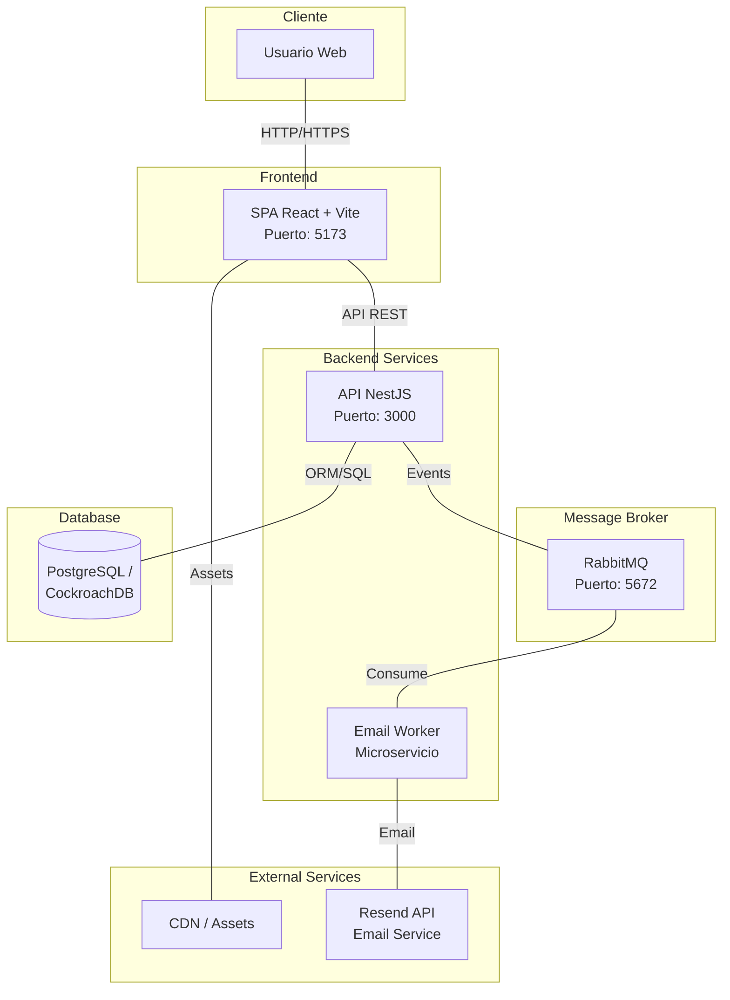

# Kaliversus

> Plataforma web completa para consulta y gestión de publicaciones académicas.

---

## 📑 Tabla de Contenido

- [Descripción](#descripción)
- [Arquitectura del Sistema](#arquitectura-del-sistema)
- [Estructura del Proyecto](#estructura-del-proyecto)
- [Requisitos Previos](#requisitos-previos)
- [Instrucciones de Despliegue](#instrucciones-de-despliegue)
- [Cómo Levantar los Servicios](#cómo-levantar-los-servicios)
- [Tecnologías](#tecnologías)
- [CI/CD](#cicd)
- [Base de Datos](#base-de-datos)
- [Documentación API](#documentación-api)
- [Créditos](#créditos)

---

## Descripción

Kaliversus es una plataforma completa para explorar, buscar y gestionar publicaciones académicas. Consta de:

- **Frontend**: SPA desarrollada en React + Vite con experiencia moderna para usuarios y administradores
- **Backend**: API REST desarrollada en NestJS con TypeScript
- **Sistema de notificaciones**: Worker de emails con RabbitMQ
- **Base de datos**: PostgreSQL/CockroachDB

---

## Arquitectura del Sistema



**Flujo de datos:**
1. El usuario accede al frontend (React SPA)
2. El frontend consume la API REST del backend
3. El backend accede a la base de datos y publica eventos en RabbitMQ
4. El Email Worker consume eventos y envía notificaciones vía Resend
5. Los assets estáticos se sirven desde CDN

---

## Estructura del Proyecto

```
kaliversus/
├── kaliversus_front/              # Frontend React
│   ├── public/                    # Archivos estáticos
│   ├── src/
│   │   ├── assets/               # Imágenes y recursos
│   │   ├── components/           # Componentes reutilizables
│   │   ├── pages/                # Vistas principales
│   │   ├── services/             # Lógica de acceso a APIs
│   │   ├── App.jsx
│   │   └── main.jsx
│   ├── package.json
│   ├── vite.config.js
│   └── README.md
├── kaliversus_api/               # Backend NestJS
│   ├── src/
│   │   ├── modules/              # Módulos de la aplicación
│   │   ├── migrations/           # Migraciones de BD
│   │   └── main.ts
│   ├── docker-compose.yml
│   ├── package.json
│   └── README.md
└── README.md                     # Este archivo
```

---

## Requisitos Previos

### Software necesario:
- **Node.js** >= 18.x
- **npm** >= 9.x
- **Docker** y **Docker Compose** (recomendado)
- **PostgreSQL** (si no usas Docker)
- **RabbitMQ** (si no usas Docker)

### Servicios externos:
- Cuenta en [Resend](https://resend.com) para envío de emails
- CDN (opcional, para assets estáticos)

---

## Instrucciones de Despliegue

### 🐳 Opción 1: Despliegue con Docker Compose (Recomendado)

Esta opción levanta toda la infraestructura automáticamente:

```bash
# 1. Clonar el repositorio
git clone <REPO_URL>
cd kaliversus

# 2. Configurar variables de entorno del backend
cd kaliversus_api
cp .env.example .env
# Editar .env con tus configuraciones

# 3. Levantar todos los servicios
docker compose up -d --build
```

Los servicios estarán disponibles en:
- **Frontend**: http://localhost:5173
- **API Backend**: http://localhost:3000
- **Documentación API**: http://localhost:3000/api/docs
- **RabbitMQ Management**: http://localhost:15672

### 🔧 Opción 2: Despliegue Manual

#### Backend (API + Worker)

```bash
# 1. Configurar el backend
cd kaliversus_api
npm install

# 2. Configurar variables de entorno
cp .env.example .env
# Editar .env con configuraciones de BD, RabbitMQ, Resend, etc.

# 3. Ejecutar migraciones
npm run typeorm:migration:run

# 4. Compilar
npm run build

# 5. Iniciar en producción
npm run start:prod
```

#### Frontend

```bash
# 1. Configurar el frontend
cd kaliversus_front
npm install

# 2. Configurar variables de entorno (opcional)
# Crear .env con la URL de la API backend

# 3. Compilar para producción
npm run build

# 4. Servir la aplicación
npm run preview
# O subir el contenido de 'dist' a Vercel/Netlify/nginx
```

### ☁️ Despliegue en Producción

Para producción, recomendamos:

- **Frontend**: Vercel, Netlify, o servidor web estático
- **Backend**: VPS con Docker, Railway, Heroku, etc.
- **Base de datos**: PostgreSQL managed (AWS RDS, Google Cloud SQL, etc.) o CockroachDB
- **Message Broker**: RabbitMQ managed o CloudAMQP

---

## Cómo Levantar los Servicios

### 🚀 Desarrollo Local

#### 1. Base de datos y servicios auxiliares
```bash
# Opción A: Con Docker Compose (solo servicios)
docker compose up -d postgres rabbitmq

# Opción B: Manual
# - Instalar y configurar PostgreSQL
# - Instalar y configurar RabbitMQ
```

#### 2. Backend - API Principal
```bash
cd kaliversus_api

# Modo desarrollo
npm run start:dev

# Modo producción
npm run start:prod
```

#### 3. Backend - Email Worker
```bash
cd kaliversus_api

# Iniciar worker de emails
npm run start:worker
```

#### 4. Frontend
```bash
cd kaliversus_front

# Modo desarrollo
npm run dev

# Modo producción
npm run build && npm run preview
```

### 📊 Servicios y Puertos

| Servicio | Puerto | URL Local | Descripción |
|----------|--------|-----------|-------------|
| Frontend | 5173 | http://localhost:5173 | Aplicación React |
| API Backend | 3000 | http://localhost:3000 | API REST principal |
| Swagger Docs | 3000 | http://localhost:3000/api/docs | Documentación API |
| PostgreSQL | 5432 | localhost:5432 | Base de datos |
| RabbitMQ | 5672 | localhost:5672 | Message broker |
| RabbitMQ Management | 15672 | http://localhost:15672 | Panel de RabbitMQ |

### 🔍 Verificar que los servicios están corriendo

```bash
# Verificar API
curl http://localhost:3000/health

# Verificar Frontend
curl http://localhost:5173

# Verificar PostgreSQL
psql -h localhost -p 5432 -U <usuario> -d <database>

# Verificar RabbitMQ
curl -u guest:guest http://localhost:15672/api/overview
```

---

## Tecnologías

### Frontend
- **React** 19
- **Vite**
- **Tailwind CSS**
- **React Router**
- **Heroicons**

### Backend
- **NestJS** (Node.js + TypeScript)
- **TypeORM**
- **PostgreSQL / CockroachDB**
- **RabbitMQ**
- **Swagger/OpenAPI**

### DevOps
- **Docker & Docker Compose**
- **GitHub Actions** (CI/CD)
- **Jest** (Testing)

### Servicios Externos
- **Resend** (Email service)
- **CDN** (Assets estáticos)

---

## CI/CD

El proyecto incluye un workflow de GitHub Actions que:

- ✅ Ejecuta lint, build y tests en cada push/PR
- 🚀 Despliega automáticamente a servidor vía SSH
- 📊 Ejecuta migraciones de base de datos
- 🐳 Usa Docker Compose para despliegue

### Variables secretas requeridas:
- `SERVER_HOST`: IP del servidor
- `SERVER_USER`: Usuario SSH
- `SERVER_SSH_KEY`: Clave SSH privada

---

## Base de Datos

### Migraciones

```bash
# Generar nueva migración
npm run typeorm:migration:generate -- -n NombreDeLaMigracion

# Ejecutar migraciones pendientes
npm run typeorm:migration:run

# Revertir última migración
npm run typeorm:migration:revert
```

### Respaldo

```bash
# Crear respaldo de la base de datos
npm run db:backup
```

El archivo se guardará como `backup_YYYYMMDD_HHMMSS.dump`.

---

## Documentación API

Una vez que el backend esté corriendo, puedes acceder a:

- **Swagger UI**: http://localhost:3000/api/docs
- **OpenAPI JSON**: http://localhost:3000/api/docs-json

---

## Créditos

- **Equipo Kaliversus**
- **Framework**: [NestJS](https://nestjs.com/)
- **Frontend**: React + Vite
- **UI Icons**: Heroicons

---

## Licencia

[MIT License](LICENSE)

---

## Soporte

Para reportar bugs o solicitar features, crear un issue en el repositorio.